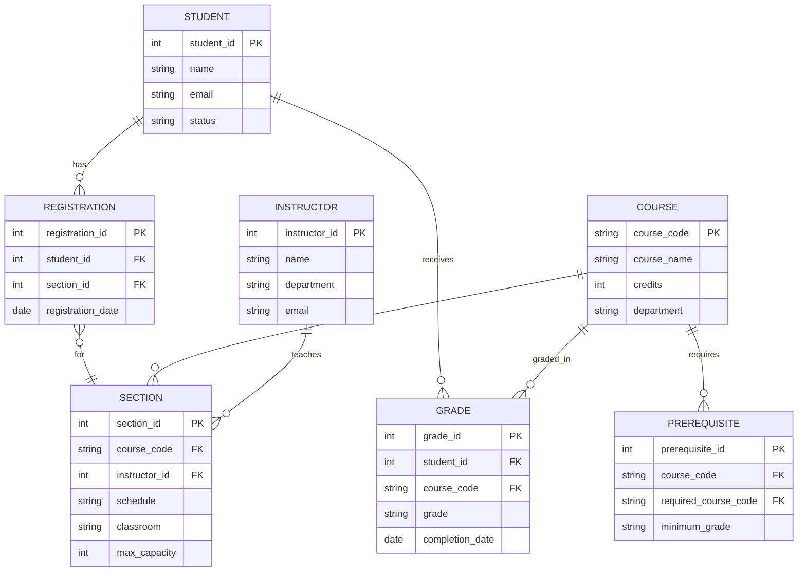

# Homework 2 - Part 2: Extended Design with Prerequisites

## Updated ER Diagram with Prerequisite Support

## New Tables Added:

### 1. Prerequisite Table
| Column Name | Data Type | Description | Constraint |
|-------------|-----------|-------------|------------|
| prerequisite_id | INT | Unique identifier | PRIMARY KEY |
| course_code | VARCHAR(10) | Course that has prerequisite | FOREIGN KEY (Course) |
| required_course_code | VARCHAR(10) | Required prerequisite course | FOREIGN KEY (Course) |
| minimum_grade | VARCHAR(2) | Minimum passing grade (e.g., 'C') | |

### 2. Grade Table
| Column Name | Data Type | Description | Constraint |
|-------------|-----------|-------------|------------|
| grade_id | INT | Unique identifier | PRIMARY KEY |
| student_id | INT | Student who received grade | FOREIGN KEY (Student) |
| course_code | VARCHAR(10) | Course for which grade is given | FOREIGN KEY (Course) |
| grade | VARCHAR(2) | Grade received (A, B, C, D, F, W) | |
| completion_date | DATE | Date course was completed | |

## Relationships:
1. **Course → Prerequisite**: One course can have multiple prerequisites
2. **Student → Grade**: One student can have multiple grades
3. **Course → Grade**: One course can have multiple grade records
